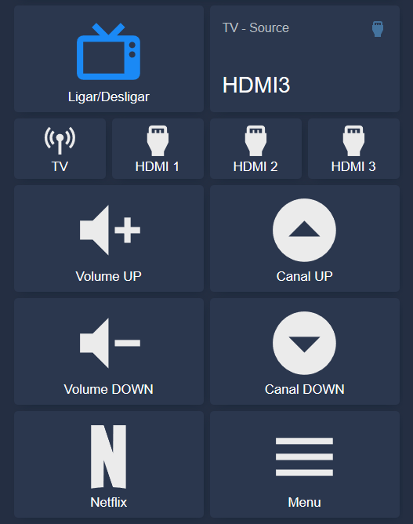
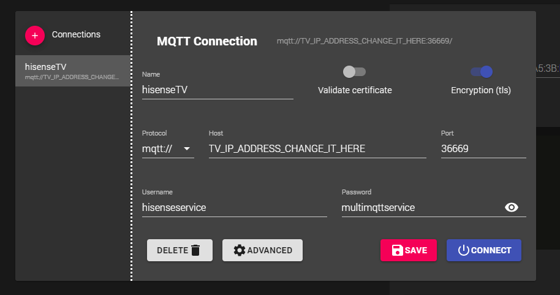

## Integrating a smart TV from Hisense on Home Assistant, using MQTT on your local network.

This is my successful experience getting this to work, with a TV Hisense H43B7320 and its firmware version `V0000.01.00a.K0117`.

Tested on Home Assistant Core version 0.111.4 and Mosquitto add-on version 5.1.

First of all, install the RemoteNow app on your android smartphone (https://play.google.com/store/apps/details?id=com.universal.remote.ms&hl=en). Pair the said smartphone with the TV, using the app. Save the mac address of this device for later.

Your need to access the following path, having beforehand the Samba add-on installed on your Home Assistant instance:

- Windows: `\\YOUR_HA_LAN_IP\`
- Linux: `smb://YOUR_HA_LAN_IP/`

Put this inside a `hisense.conf`, in the above path - subfolder `/share/mosquitto/`. Change only the `TV_IP_ADDRESS_CHANGE_IT_HERE`, accordingly:

```
connection hisensemqtt
address TV_IP_ADDRESS_CHANGE_IT_HERE:36669
username hisenseservice
password multimqttservice
clientid HomeAssistant
bridge_cafile /ssl/hisense.crt
bridge_insecure true
bridge_tls_version tlsv1.2
try_private false
start_type automatic
topic +/remoteapp/# both
```

Inside the Mosquitto add-on configuration (previously installed, mandatory), in HA, change `active` from `false` to `true`:

```
customize:
  active: true
  folder: mosquitto
```

Run this command inside a linux terminal, to get the certificates needed to connect to the TVs embedded MQTT broker:

```
openssl s_client -host TV_IP_ADDRESS_CHANGE_IT_HERE -port 36669 -showcerts
```

Copy-paste inside the file `/ssl/hisense.crt` both certificates shown from the previous command, with this structure as an example:

```
-----BEGIN CERTIFICATE-----
qmierjfpaoisdjmçfaisldjcçfskdjafcaçskdjcçfmasidcf(...)
-----END CERTIFICATE-----

-----BEGIN CERTIFICATE-----
7ferusycedaystraedyasredyatrdsecdtrseydtraESYDTRASCY (...)
-----END CERTIFICATE-----
```

Inside the HA `known_devices.yaml` file create this entry:

```
hisense_tv:
  icon: 'mdi:television-classic'
  mac: TV_MAC_ADDRESS_CHANGE_IT_HERE
  name: 'Hisense TV'
  picture:
  track: true
```

Inside the HA `configuration.yaml` file create these entries accordingly. Change here the smartphone mac address, previously saved by you, as stated (`SMARTPHONE_MAC_ADDRESS_AUTHORIZED_PREVIOUSLY_WITH_THE_APP_REMOTENOW`  == `AA:BB:CC:DD:EE:FF`):

```yaml

switch:
  - platform: template
    switches:
      hisense_tv:
        icon_template: >
          
            {{ 'mdi:television-classic' }}
          
            {{ 'mdi:television-classic-off' }}
          
        friendly_name: 'Hisense TV'
        value_template: >
          {{ is_state('device_tracker.hisense_tv', 'home') }}
        turn_on:
          service: wake_on_lan.send_magic_packet
          data:
            mac: 'TV_MAC_ADDRESS_CHANGE_IT_HERE'
        turn_off:
          service: mqtt.publish
          data:
            topic: '/remoteapp/tv/remote_service/SMARTPHONE_MAC_ADDRESS_AUTHORIZED_PREVIOUSLY_WITH_THE_APP_REMOTENOW$normal/actions/sendkey'
            payload: 'KEY_POWER'

wake_on_lan:

sensor:
  - platform: mqtt
    name: "TV - Source"
    state_topic: "/remoteapp/mobile/broadcast/ui_service/state"
    value_template: "{{ value_json.sourceid }}"
```

Inside the HA `scripts.yaml` file paste these scripts, useful later on to the lovelace card. Change here the smartphone mac address, previously saved by you, as stated (`SMARTPHONE_MAC_ADDRESS_AUTHORIZED_PREVIOUSLY_WITH_THE_APP_REMOTENOW` == `AA:BB:CC:DD:EE:FF`)

```yaml
executa_hisense_input_tv:
  alias: TV - Input TV
  sequence:
    - service: mqtt.publish
      data:
        topic: '/remoteapp/tv/ui_service/SMARTPHONE_MAC_ADDRESS_AUTHORIZED_PREVIOUSLY_WITH_THE_APP_REMOTENOW$normal/actions/changesource'
        payload: '{"displayname":"TV","hotel_mode":"","isDemo":false,"is_lock":"","is_signal":"","sourceid":"0","sourcename":"TV"}'

executa_hisense_input_hdmi_1:
  alias: TV - Input HDMI 1
  sequence:
    - service: mqtt.publish
      data:
        topic: '/remoteapp/tv/ui_service/SMARTPHONE_MAC_ADDRESS_AUTHORIZED_PREVIOUSLY_WITH_THE_APP_REMOTENOW$normal/actions/changesource'
        payload: '{"displayname": "HDMI1","hotel_mode": "","isDemo": false,"is_lock": "","is_signal": "","sourceid": "4","sourcename": "HDMI1"}'

executa_hisense_input_hdmi_2:
  alias: TV - Input HDMI 2
  sequence:
    - service: mqtt.publish
      data:
        topic: '/remoteapp/tv/ui_service/SMARTPHONE_MAC_ADDRESS_AUTHORIZED_PREVIOUSLY_WITH_THE_APP_REMOTENOW$normal/actions/changesource'
        payload: '{"displayname": "HDMI2","hotel_mode": "","isDemo": false,"is_lock": "","is_signal": "","sourceid": "5","sourcename": "HDMI2"}'

executa_hisense_input_hdmi_3:
  alias: TV - Input HDMI 3
  sequence:
    - service: mqtt.publish
      data:
        topic: '/remoteapp/tv/ui_service/SMARTPHONE_MAC_ADDRESS_AUTHORIZED_PREVIOUSLY_WITH_THE_APP_REMOTENOW$normal/actions/changesource'
        payload: '{"displayname": "HDMI3","hotel_mode": "","isDemo": false,"is_lock": "","is_signal": "","sourceid": "6","sourcename": "HDMI3"}'

executa_hisense_volume_up:
  alias: TV - Volume up
  sequence:
    - service: mqtt.publish
      data:
        topic: '/remoteapp/tv/remote_service/SMARTPHONE_MAC_ADDRESS_AUTHORIZED_PREVIOUSLY_WITH_THE_APP_REMOTENOW$normal/actions/sendkey'
        payload: 'KEY_VOLUMEUP'
        
executa_hisense_volume_down:
  alias: TV - Volume down
  sequence:
    - service: mqtt.publish
      data:
        topic: '/remoteapp/tv/remote_service/SMARTPHONE_MAC_ADDRESS_AUTHORIZED_PREVIOUSLY_WITH_THE_APP_REMOTENOW$normal/actions/sendkey'
        payload: 'KEY_VOLUMEDOWN'

executa_hisense_channel_up:
  alias: TV - Channel up
  sequence:
    - service: mqtt.publish
      data:
        topic: '/remoteapp/tv/remote_service/SMARTPHONE_MAC_ADDRESS_AUTHORIZED_PREVIOUSLY_WITH_THE_APP_REMOTENOW$normal/actions/sendkey'
        payload: 'KEY_CHANNELUP'
        
executa_hisense_channel_down:
  alias: TV - Channel down
  sequence:
    - service: mqtt.publish
      data:
        topic: '/remoteapp/tv/remote_service/SMARTPHONE_MAC_ADDRESS_AUTHORIZED_PREVIOUSLY_WITH_THE_APP_REMOTENOW$normal/actions/sendkey'
        payload: 'KEY_CHANNELDOWN'

executa_hisense_home:
  alias: TV - Home
  sequence:
    - service: mqtt.publish
      data:
        topic: '/remoteapp/tv/remote_service/SMARTPHONE_MAC_ADDRESS_AUTHORIZED_PREVIOUSLY_WITH_THE_APP_REMOTENOW$normal/actions/sendkey'
        payload: 'KEY_HOME'

executa_hisense_netflix:
  alias: TV - Netflix
  sequence:
    - service: mqtt.publish
      data:
        topic: '/remoteapp/tv/ui_service/SMARTPHONE_MAC_ADDRESS_AUTHORIZED_PREVIOUSLY_WITH_THE_APP_REMOTENOW$normal/actions/launchapp'
        payload: '{"appIcon":"","appId":"1","has_detail_page":0,"isLocalApp":1,"name":"Netflix","storeType":0,"type":0,"url":"netflix","urlType":37}'
```

Create a `manual` lovelace card with this proposal:

```yaml
cards:
  - cards:
      - type: horizontal-stack
        cards:
          - type: button
            tap_action:
              action: toggle
            hold_action:
              action: more-info
            show_icon: true
            show_name: true
            entity: switch.hisense_tv
            name: ON/OFF
          - type: entity
            entity: sensor.tv_source
            icon: 'mdi:video-input-hdmi'
      - cards:
          - entity: script.executa_hisense_input_tv
            hold_action:
              action: more-info
            show_icon: true
            show_name: true
            tap_action:
              action: toggle
            type: button
            name: TV
          - entity: script.executa_hisense_input_hdmi_1
            hold_action:
              action: more-info
            show_icon: true
            show_name: true
            tap_action:
              action: toggle
            type: button
            name: HDMI 1
          - entity: script.executa_hisense_input_hdmi_2
            hold_action:
              action: more-info
            show_icon: true
            show_name: true
            tap_action:
              action: toggle
            type: button
            name: HDMI 2
          - entity: script.executa_hisense_input_hdmi_3
            hold_action:
              action: more-info
            show_icon: true
            show_name: true
            tap_action:
              action: toggle
            type: button
            name: HDMI 3
        type: horizontal-stack
      - cards:
          - cards:
              - entity: script.executa_hisense_volume_up
                hold_action:
                  action: more-info
                show_icon: true
                show_name: true
                tap_action:
                  action: toggle
                type: button
                name: Volume UP
              - entity: script.executa_hisense_volume_down
                hold_action:
                  action: more-info
                show_icon: true
                show_name: true
                tap_action:
                  action: toggle
                type: button
                name: Volume DOWN
            type: vertical-stack
          - cards:
              - cards:
                  - entity: script.executa_hisense_channel_up
                    hold_action:
                      action: more-info
                    show_icon: true
                    show_name: true
                    tap_action:
                      action: toggle
                    type: button
                    name: Channel UP
                  - entity: script.executa_hisense_channel_down
                    hold_action:
                      action: more-info
                    show_icon: true
                    show_name: true
                    tap_action:
                      action: toggle
                    type: button
                    name: Channel DOWN
                type: vertical-stack
            type: vertical-stack
        type: horizontal-stack
      - cards:
          - entity: script.executa_hisense_netflix
            hold_action:
              action: more-info
            show_icon: true
            show_name: true
            tap_action:
              action: toggle
            type: button
            name: Netflix
          - entity: script.executa_hisense_home
            hold_action:
              action: more-info
            show_icon: true
            show_name: true
            tap_action:
              action: toggle
            type: button
            icon: 'mdi:menu'
            name: Menu
        type: horizontal-stack
    type: vertical-stack
type: vertical-stack

```

Customize these scripts with this proposal, inside the HA `customize.yaml` file:

```yaml
script.executa_hisense_input_tv:
  icon: 'mdi:antenna'
  
script.executa_hisense_input_hdmi_1:
  icon: 'mdi:video-input-hdmi'
  
script.executa_hisense_input_hdmi_2:
  icon: 'mdi:video-input-hdmi'
  
script.executa_hisense_input_hdmi_3:
  icon: 'mdi:video-input-hdmi'

script.executa_hisense_netflix:
  icon: 'mdi:netflix'
  
script.executa_hisense_volume_up:
  icon: 'mdi:volume-plus'

script.executa_hisense_volume_down:
  icon: 'mdi:volume-minus'  

script.executa_hisense_channel_up:
  icon: 'mdi:arrow-up-drop-circle'
  
script.executa_hisense_channel_down:
  icon: 'mdi:arrow-down-drop-circle'
  
script.executa_hisense_home:
  icon: 'mdi:menu-open'
```

Will be similar to this:



## Further debugging or exploring the MQTT broker inside the TV

You may install the software `MQTT Explorer` (http://mqtt-explorer.com/) and use in your local network with these configurations:




If your can not stabilish a successful connection with the TV, first, try disabling the TLS encryption on the MQTT Explorer. Some older TVs or firmwares don't have encryption enabled. If so, you may need to change the above `/share/mosquitto/hisense.conf`file accordingly.
